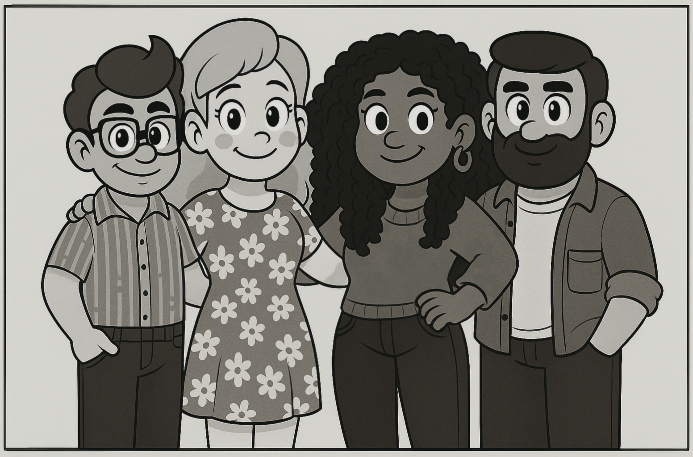
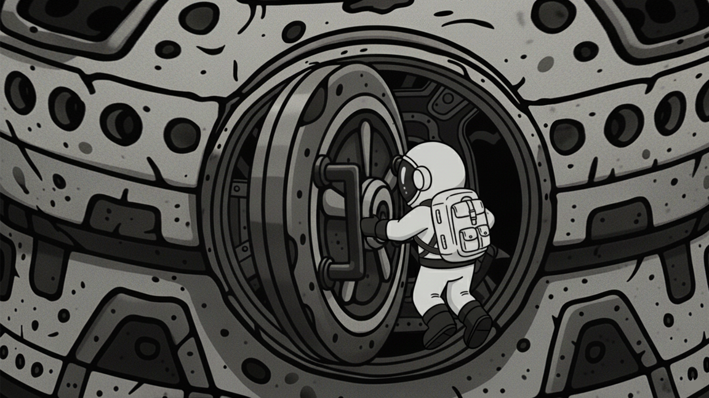
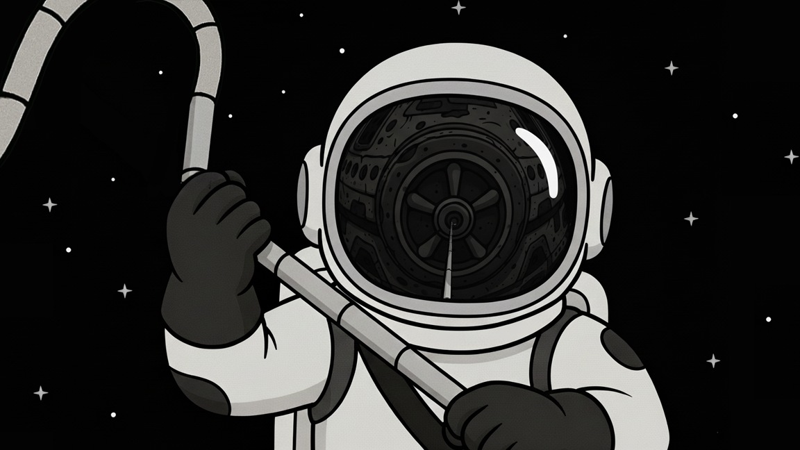
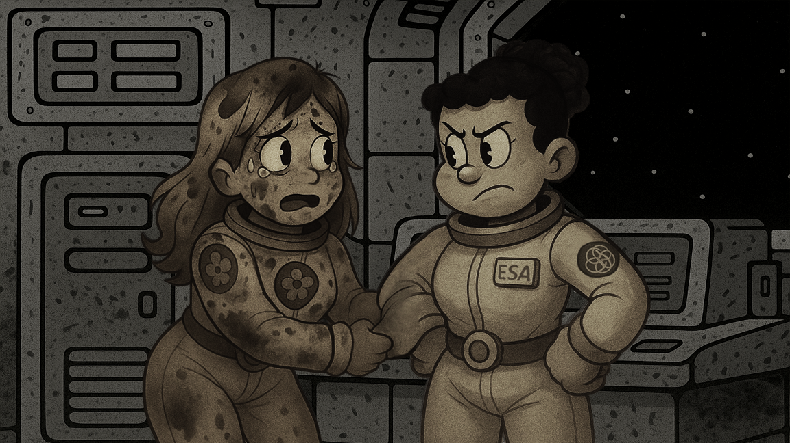
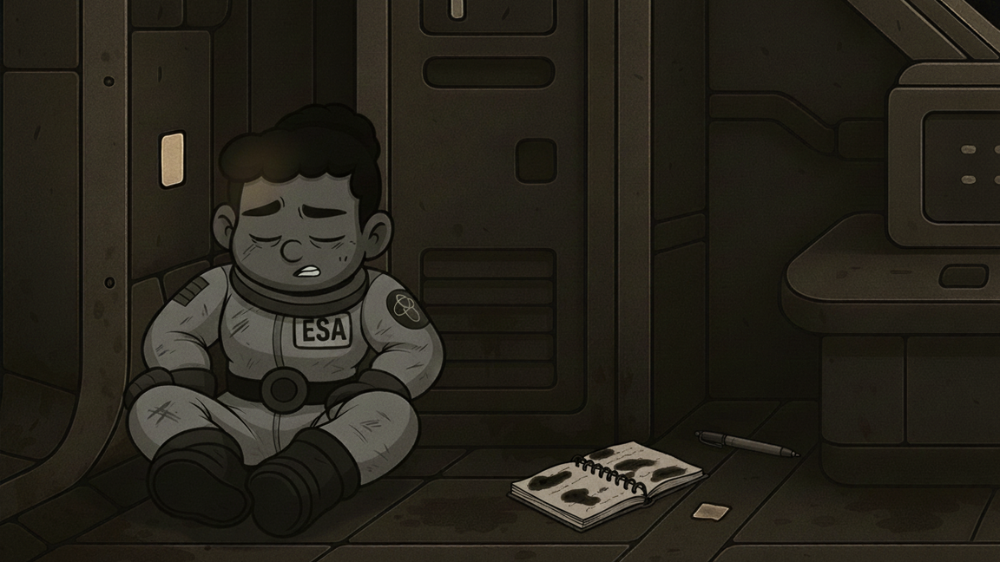

<div align="center">

# 🚀 AI Space — Visual Novel

### Algo anda mal a bordo de la nave *Spark*.

Una novela visual de ciencia ficción donde explorás la nave, conversás con la
tripulación y desentrañás qué salió mal — bajo la mirada de **Spark**, la IA de a bordo.




</div>

---

## 🌌 Sobre el juego

Despertás a bordo de la **Spark**, una nave a la deriva. La tripulación está
incompleta, algo alteró los sistemas y las respuestas no aparecen solas: hay que
buscarlas. *AI Space* es una novela visual con exploración, donde cada objeto del
entorno puede esconder una pista y cada conversación puede abrir un nuevo camino.

Un proyecto individual de **FedeiaTech**, en desarrollo activo.

---

## ✨ Características

- 🛸 **Narrativa ramificada** — tus decisiones y los objetos que llevás abren (o cierran) caminos.
- 🔍 **Modo exploración** — clickeá los objetos del entorno para descubrir pistas y desencadenar escenas.
- 🎒 **Inventario y misiones** — juntá objetos que habilitan nuevas opciones de diálogo.
- ⏳ **Tiempo en cuenta regresiva** — un reloj que corre mientras decidís.
- 🎭 **Elenco expresivo** — expresiones faciales y "voces" que cambian según quién habla y qué siente.
- 📖 **Diario de diálogos** — volvé sobre lo que ya pasó sin perder el hilo.

---

## 🎮 Controles

| Tecla | Acción |
|-------|--------|
| `Espacio` / `Enter` / `Clic` | Avanzar diálogo |
| `I` | Inventario |
| `J` | Diario de diálogos |
| `M` | Registro de misiones |
| `Esc` | Pausa |

---

## 🖼️ Galería

<table>
  <tr>
    <td></td>
    <td></td>
  </tr>
  <tr>
    <td></td>
    <td></td>
  </tr>
</table>

---

## 🛰️ Estado del proyecto

**v0.0.9 Alpha** — jugable, con el motor narrativo, exploración, inventario,
misiones y sistema de tiempo funcionando.

> 🔭 **Próximamente:** la **v0.0.10** está en desarrollo con una renovación
> profunda del motor interno. Más noticias pronto.

---

## 🛠️ Ejecutar el proyecto

1. Cloná el repositorio:
   ```bash
   git clone https://github.com/FedeiaTech/AI-Space-Visual-Novel-GD.git
   ```
2. Abrí **Godot Engine 4.6** (o superior), importá el `project.godot` de la
   carpeta clonada y presioná **Editar**.
3. Ejecutá con **F5**.

---

<details>
<summary>📜 <strong>Historial de versiones</strong> (click para expandir)</summary>

<br>

**v0.0.9 (01-11-2025):**
* **Optimización Profunda del Motor:** reestructuración masiva de la arquitectura interna para mejorar la estabilidad, el rendimiento y facilitar futuras mecánicas.
* **Mejoras de Rendimiento Clave:** los saltos entre diálogos (`goto`) y la carga de objetos interactivos ahora son instantáneos.
* **Nuevas Mecánicas de Diálogo:** efecto de **temblor de pantalla** (`shake`) y **desplazamiento de personajes** (`move_character`).
* **Sistema de Sonido de Voz Mejorado:** el "blip" del diálogo varía según el género del personaje e incluye sonidos únicos para expresiones específicas.
* **Gestión de Ítems Centralizada:** base de datos de ítems para asegurar la consistencia de objetos, nombres y descripciones.
* **Herramientas de Desarrollo:** **"Modo de Depuración"** secreto desde el menú principal para testear todas las funciones sin afectar la historia.

**v0.0.8 (10-09-2025):**
* Carga de **imágenes CG** en diálogo con transiciones personalizables.
* **Modo de exploración** para ocultar la UI y permitir interacciones con el entorno.
* **Retroalimentación visual** de objetos clickeables (`hover`/`pressed`).
* Nuevo **Menú de Pausa** funcional.
* Correcciones en transiciones de escena y selección de botones.

**v0.0.7 (23-08-2025):**
* Escenarios convertidos en **entornos interactivos explorables** con objetos clickeables.
* Sistema robusto de eventos para **narrativa no lineal** (saltos internos y externos).
* Arquitectura consolidada con **Autoloads** (`SceneLibrary`, `StoryLibrary`).

**v0.0.6 (16-08-2025):**
* **Renovación completa de la UI** y resolución a **1280×720**.
* Menús Principal y de Opciones reestructurados y coexistentes.
* **Controles de volumen** y **configuración de resolución** en tiempo real.
* **Diario de Diálogos Global** (`JournalManager`).
* Correcciones críticas en el flujo de comandos.

**v0.0.5 (08-08-2025):**
* **Diálogos Condicionales** (basados en ítems) y **Banderas de Misión** (`set_flag`).
* **Sistema de Tiempo Regresivo** (`TimeManager`).
* Corrección de una condición de carrera con las voces durante las transiciones.
* Corrección del "fantasma" del personaje y unificación de visibilidad de sprites.

**v0.0.4 (29-07-2025):**
* **Refactorización mayor de la arquitectura** (`CommandProcessor`, `DialogUI`, `GameManager`).
* Mejora en la gestión de tipos y el control de visibilidad de personajes.
* Nuevos assets visuales para personajes y CGs.

**v0.0.3 (24-07-2025):**
* **Transiciones de escena perfectas** (pantalla en negro).
* **Inventario mejorado** (apilamiento y notificaciones).
* Soporte para **diálogo con Narrador**.
* Manejo refinado de entrada y pausa.

**v0.0.2 (20-07-2025):**
* **Sistema de Inventario Básico** (`InventoryManager`, pausa automática).
* **Manejo de entrada global** incluso en pausa.

**v0.0.1 Alpha (17-07-2025):**
* Mecánicas base: cambios de escena, expresiones, BGM/SFX, transiciones y pantalla de inicio.

</details>

---

## 🤝 Contribución

Proyecto en fase temprana de desarrollo individual. Si te interesa contribuir en el
futuro, contactá al dueño del repositorio.

## 📄 Licencia

Copyright © 2025 **FedeiaTech**. Todos los derechos reservados.
